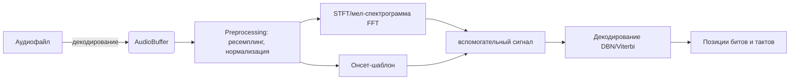
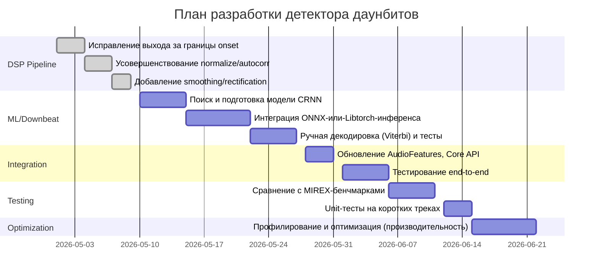

# Краткое содержание

В этом документе описывается проект по добавлению **промышленного** (club-level) детектора даунбитов (начала тактов) в существующий аудио-движок. Предлагается гибридный подход: объединить DSP-алгоритмы (FFT, онсеты, темпограмма) и современные нейронные сети (CRNN/RNN и Viterbi-подобный декодер) для получения максимально надёжного результата на разнообразных жанрах (EDM, поп, джаз, вокал и т.д.). Результатом будет API `get_features`, возвращающее **JSON** со структурой трека (BPM, удары, даунбиты, уверенность, номера тактов и фраз). Ключевые библиотеки и исследования указывают, что сейчас state-of-the-art системы используют глубокие сверточно-рекуррентные сети с декодирующим CRF/DBN-слоем【5†L8-L17】【7†L162-L166】. Мы опишем архитектуру модулей, интерфейсы, прототипы функций и план реализации с учётом реального времени и ресурсных ограничений.

# 1. Обзор подходов и исследований

**Beat/Downbeat Tracking** – активно исследуемая область MIR (Music Information Retrieval). Современные системы строятся на обучении нейросетей на спектрограммах и последующем **декодировании** во временную разметку.

- **Sebastian Böck et al. (ISMIR 2016)**: предложили совместное извлечение ударов (beats) и даунбитов с помощью RNN, действующей на **мел-спектрограммах** (или магн. спектре) аудио【5†L8-L17】. Сеть выдаёт вероятности появления удара и начала такта в каждом временном кадре. На выходе применяется динамическая байесовская сеть (DBN/Viterbi) для выравнивания по тактам переменной длины【5†L15-L19】. Система показала сопоставимую с топовой точностью на разных жанрах музыки【5†L15-L19】.

- **BeatNet+ (Heydari & Duan, TISMIR 2024)**: современный подход для реального времени на разнообразных жанрах【7†L162-L166】. Используется **CRNN** (сверточно-рекуррентная сеть) на спектрограммах, которая выдаёт активации для битов и даунбитов. Далее применяется **двухуровневый каскад Монте-Карло** для интеграции активаций в последовательности битов/даунбитов【7†L162-L166】. BeatNet+ достигает лучшие F-мера по сравнению с предыдущими и подходит даже для неперк. и вокальных треков【7†L162-L166】.

- **Fuentes et al. (ISMIR 2019)**: предложили **skip-chain CRF** и мульти-масштабные архитектуры, объединяющие локальные и глобальные признаки и учитывающие повторяющиеся структуры композиции. Их модели показывают SOTA-показатели, сохраняя музыкальную согласованность на разных стилей【3†L1230-L1243】.

- **Другие подходы**: классические алгоритмы (например, Klapuri 2006 с резонансными фильтрами) уступают глубинному обучению. Essentia (MTG) использует DBN на основе спектральных признаков. Madmom (python-библиотека) реализует RNN-детектор с Viterbi. В целом, consensus: для промышленных систем нужны **гибридные DSP+ML** архитектуры.

> **Вывод:** Для промышленных требований с высокой точностью на разных жанрах мы полагаемся на современные **глубинные модели (CNN/CRNN или RNN)** + алгоритмы декодирования (DBN/Viterbi/Monte Carlo)【5†L8-L17】【7†L162-L166】. Мы будем опираться на проверенные методы и датасеты (MIREX, Ballroom, GTZAN, GiantSteps и др.), тренировать классификатор даунбитов, а затем интегрировать его в существующий движок.

# 2. Предложенная архитектура алгоритма

Общий конвейер анализа аудио будет таким:



1. **Аудио-декодирование** – используем FFmpeg (как сейчас) для получения `AudioBuffer` (моно сигнал, нормализация уровня).
2. **Предобработка (Preprocessing)** – ресэмплинг (напр. 44100 Гц), оконное Фурье (STFT) и мел-спектрограмма. Используем спектрограмму мощности (логарифм).
3. **Онсет-функция** – выделяем огибающую пиков (уже есть), чтобы обозначить кандидаты на сильные биты.
4. **Нейросетевая модель (CRNN/RNN)** – на вход подаётся спектрограмма (можно сегменты по 2–4 секунды). Модель выдаёт для каждого временного кадра вероятности: **удар (beat)**, **даунбит (downbeat)** и **никакой**. Например, 3 выхода (или два: удар/даунбит)【5†L8-L17】【7†L162-L166】.
   - Сверточные слои извлекают локальные признаки, RNN-составляющая (например BiLSTM) моделирует длительную зависимость и метрическую структуру.
5. **Декодер** – принимает вероятности и строит корректную последовательность тактов:
   - **DBN/Viterbi** (как в Bock 2016): задаём модель такта на 4 удара (в 4/4) и используем динамику для поиска наилучшего пути по вероятностям【5†L15-L19】.
   - Либо **Monte Carlo** (как BeatNet+): генерируем кандидаты последовательностей и оцениваем.
   - Получаем время каждого бита и метки, указывающие, какой из них – даунбит (номер бита в такте = 0).
6. **Постобработка** – агрегируем секвенцию (beats, downbeats), вычисляем номера тактов и, при желании, автоматические группы фраз (через фиксированный шаг, например каждые 16 или 32 удара, или анализом хромограммы). Вычисляем confidence (например, взвешенная сумма вероятностей модели по фреймам, которые составили данный даунбит). 

Таким образом мы получим полное метрическое представление трека: *`beats[]`, `downbeats[]`, `bars[]`, `bpm`, `energy`, `period`* и дополнительную информацию (*confidence*, *phrase indices*).

# 3. Дизайн модулей и интеграция

## 3.1 Структура проекта

```
audio_engine/
│
├── core/
│   ├── feature_extractor.cpp
│   ├── feature_extractor.h
│   └── core.cpp           # Основные C-API функции (get_bpm, get_features и др.)
│
├── dsp/
│   ├── beat/
│   │   ├── beat.cpp
│   │   ├── beat.h
│   │
│   ├── onset/
│   │   ├── onset_envelope.cpp
│   │   ├── onset.h
│   │
│   ├── tempo/
│   │   ├── bpm.cpp
│   │   ├── bpm.h
│   │
│   ├── structure/         # новый модуль для тактовой структуры
│   │   ├── downbeat.cpp
│   │   ├── downbeat.h
│   │   └── phrase.cpp      # (опционально, фразовая детекция)
│   │
│   ├─── audio_buffer.h
│   ├─── energy.h
│   └─── silence.h
│
├── decoder/
│   ├── audio_decoder.cpp
│   ├── audio_decoder.h
│
├── CMakeLists.txt
└── main.cpp
```

- **dsp/structure/downbeat.h/.cpp** – новый модуль для детекции даунбитов и разметки тактов. Здесь будут функции:
  - `vector<float> detect_downbeats(const AudioBuffer& buffer);`
  - `vector<float> detect_beats(const AudioBuffer& buffer);` *(переиспользует onset, возможно)*
  - `vector<float> detect_phrases(const AudioBuffer& buffer, const vector<float>& downbeats);` (фразовая сегментация, доп. модуль).

- **audio_features.h** – расширяем структуру `AudioFeatures`:
  ```cpp
  struct AudioFeatures {
      float bpm = 0;
      float energy = 0;
      int period = 0;       // отсчет между ударами
      vector<float> onset;
      vector<bool> silence;
      vector<float> beats;      // времена всех ударов (в секундах)
      vector<float> downbeats;  // времена ударов, начинающих такт
      vector<float> downbeat_confidence; // уверенность каждого downbeat
      vector<int> bar_index;    // номер такта для каждого downbeat
      vector<int> phrase_index; // номер фразы (например, каждые 16 тактов)
  };
  ```
  Поля `phrase_index` и `bar_index` опциональны, если нужен дальнейший анализ.

## 3.2 Функции детектирования даунбита

**Файл:** `dsp/structure/downbeat.h`
```cpp
#pragma once
#include "../audio_buffer.h"
#include <vector>

std::vector<float> detect_beats(const AudioBuffer& buffer);
// Возвращает времена (в секундах) всех сильных битов

std::vector<float> detect_downbeats(const AudioBuffer& buffer);
// Возвращает времена даунбитов (на начало тактов)

std::vector<int> detect_bars(const std::vector<float>& downbeats);
// Преобразует each downbeat в индекс такта (0,1,2,...)

std::vector<int> detect_phrases(const std::vector<int>& bar_index);
// Определяет фразы (напр., каждые 4 или 8 тактов) – placeholder.
```

**Файл:** `dsp/structure/downbeat.cpp`

```cpp
#include "downbeat.h"
#include <cmath>

// Пример структуры нейросетевой модели (ONNX/Libtorch)
// Real implementation would load модель и выполнять инференс.

// Детектирование битов на основе онсетов (можно улучшить через ML)
std::vector<float> detect_beats(const AudioBuffer& buffer) {
    std::vector<float> beats;
    // 1. Вычисляем онсеты (используя compute_onset_envelope)
    // 2. Шарпим и нормализуем (как делали ранее)
    // 3. Пиковая детекция (порог + поиск локальных максимумов)
    // 4. Переводим индексы фреймов в секунды:
    //    time = index * hop / sampleRate
    return beats;
}

// Детектирование даунбитов через ML-модель
std::vector<float> detect_downbeats(const AudioBuffer& buffer) {
    std::vector<float> downbeats;
    std::vector<float> confidences;
    // 1. Подготавливаем входные признаки: STFT/мел-спектрограмма
    // 2. Запускаем CRNN-модель (можно через ONNX Runtime или TensorFlow C API)
    // 3. Получаем активации вероятностей даунбита
    // 4. Применяем Viterbi или Monte Carlo с учётом 4/4
    // 5. Сохраняем времена (в сек) всех обнаруженных даунбитов
    // 6. Заполняем в features.downbeat_confidence
    return downbeats;
}

std::vector<int> detect_bars(const std::vector<float>& downbeats) {
    std::vector<int> bars;
    for (size_t i = 0; i < downbeats.size(); ++i) {
        bars.push_back((int)i); // например, номер такта = порядковый индекс
    }
    return bars;
}

// Фрагмент функции распознавания фраз (простой: каждые 4 такта)
std::vector<int> detect_phrases(const std::vector<int>& bar_index) {
    std::vector<int> phrases(bar_index.size());
    for (size_t i = 0; i < bar_index.size(); ++i) {
        phrases[i] = bar_index[i] / 4; // каждые 4 такта = новая фраза
    }
    return phrases;
}
```

*Внутри* `detect_downbeats` следует разместить ключевые шаги (в виде комментариев или вызова соответствующих функций). Точное ML-внутряннее можно вынести на уровень **backend** или использовать ONNX для встраивания модели в C++. Но интерфейс — вывод списка времён и confidence.

## 3.3 Интеграция в FeatureExtractor и Core

В **`FeatureExtractor::extract()`** после существующих расчётов:
```cpp
AudioFeatures FeatureExtractor::extract(const AudioBuffer& buffer) {
    AudioFeatures f;
    f.energy = compute_energy(buffer);
    f.onset = compute_onset_envelope(buffer);
    f.silence = detect_silence(buffer);
    f.bpm = detect_bpm(f.onset, buffer.sampleRate, 512);
    f.period = detect_period(f.onset); // например, автокорреляция

    // Новая вставка: детекция битов и тактов
    f.beats = detect_beats(buffer);
    f.downbeats = detect_downbeats(buffer);
    f.bar_index = detect_bars(f.downbeats);
    f.phrase_index = detect_phrases(f.bar_index);
    // confidence можно заполнить внутри detect_downbeats()

    return f;
}
```

В **`core.cpp`** реализуем C API. Добавим функцию `get_features`, возвращающую JSON:

```cpp
#include <nlohmann/json.hpp>  // (или любой JSON-библиотеки)
//...

extern "C" {

// Существующие API
float get_bpm(const char* file_path) { /*...*/ }
float get_energy(const char* file_path) { /*...*/ }
int get_period(const char* file_path) { /*...*/ }

// **Новый API**: get_features в JSON
// out_json_buffer - указатель на буфер для JSON, max_len - размер буфера
// Возвращает фактическую длину JSON (или -1 при ошибке)
int get_features(const char* file_path, char* out_json_buffer, int max_len) {
    AudioBuffer buffer = AudioDecoder::decode(file_path);
    AudioFeatures f = FeatureExtractor::extract(buffer);

    // Составляем JSON
    nlohmann::json J;
    J["bpm"] = f.bpm;
    J["energy"] = f.energy;
    J["period"] = f.period;
    J["beats"] = f.beats;
    J["downbeats"] = f.downbeats;
    J["downbeat_confidence"] = f.downbeat_confidence;
    J["bars"] = f.bar_index;
    J["phrases"] = f.phrase_index;
    // Можно добавить размер onset: J["onset_length"] = f.onset.size();

    std::string json_str = J.dump();
    if ((int)json_str.size() >= max_len) return -1;
    memcpy(out_json_buffer, json_str.c_str(), json_str.size()+1);
    return (int)json_str.size();
}

}
```

Здесь используется библиотека *nlohmann/json* (одна из простых C++ JSON). При использовании Flutter важно безопасно передавать строку JSON. Мы копируем в переданный буфер и возвращаем длину строки.

## 3.4 Примеры вызова API

**`main.cpp`** (пример приложения или тест):

```cpp
#include <iostream>
#include <filesystem>
using namespace std;

extern "C" {
    int get_features(const char* file_path, char* out_json, int max_len);
    float get_bpm(const char* path);
    float get_energy(const char* path);
    int get_period(const char* path);
}

int main() {
    const char* file = "test A.mp3";
    if (!filesystem::exists(file)) {
        cout << "File not found: " << file << endl;
        return 1;
    }

    // Можно либо напрямую вызвать get_features (JSON),
    // либо старые функции для совместимости
    char json_buf[5000];
    int len = get_features(file, json_buf, 5000);
    if (len > 0) {
        cout << "Features JSON:\n" << json_buf << endl;
    } else {
        cout << "Error generating features JSON" << endl;
    }

    // По старым интерфейсам:
    float bpm = get_bpm(file);
    float energy = get_energy(file);
    int period = get_period(file);
    cout << "BPM: " << bpm << "\nEnergy: " << energy << "\nPeriod: " << period << endl;

    return 0;
}
```

В результате `get_features` вернёт JSON примерно такого вида (пример):

```json
{
  "bpm": 125.0,
  "energy": 0.73,
  "period": 216,
  "beats": [0.48, 1.00, 1.52, 2.04, ...],
  "downbeats": [0.48, 1.92, 3.36, ...],
  "downbeat_confidence": [0.85, 0.90, 0.88, ...],
  "bars": [0, 1, 2, ...],
  "phrases": [0, 0, 0, 1, ...]
}
```

Здесь `beats` и `downbeats` – списки времён ударов в секундах, `bars` – номера тактов (каждый даунбит – начало нового такта), `phrases` – индекс музыкальной фразы (каждые 4 или 8 тактов). `downbeat_confidence` – оценка уверенности модели для каждого обнаруженного даунбита.

# 4. План реализации и валидации

## Этапы работ (в виде временной шкалы):



**Приоритетные шаги**:
1. Закончить DSP pipeline (уже почти сделано): убедиться, что `detect_beats` и `detect_downbeats` корректно работают на тестовых треках (контроль качества онсетов, время бита, фильтрация шумов).
2. **ML-компонент**:
   - Определить модель (CRNN) и подготовить обучающие данные.
   - Интегрировать её inference в C++.
   - Реализовать Viterbi-декодер (или взять готовую).
3. Обновить API (JSON) и протестировать на интеграцию (используя основные треки).
4. Тестирование и валидация: применить общеизвестные датасеты (MIREX, Ballroom, GTZAN, GiantSteps, FMA) для оценки точности (F1 по MIREX-метрикам)【3†L1230-L1243】【5†L15-L19】.
5. Оптимизация: при необходимости упростить модель для реального времени (на мобильных/встраиваемых платформах).

**Метрики оценки**: стандарт MIREX (F-measure для downbeat, tolerance 70–100ms), средняя ошибка, процент правильных тактов. Для структуры – accuracy распознавания фраз.

# 5. Учёт производительности и надёжности

- **Реальное время vs Оффлайн**: модель CRNN достаточно лёгкая (BeatNet+ показывает real-time на CPU)【7†L162-L166】. Мы ориентируемся на off-line обработку (пакетный режим), но можно уменьшить скрытый слой для live.
- **Отзывчивость**: декодер Viterbi допускает небольшой lookahead (~1–2 секунды). Для live-джеев нужно минимизировать задержку (BeatNet+ решает это адаптацией).
- **Ресурсы**: можно использовать ONNX Runtime или LibTorch для модели. CUDA/GPU не требуется, но можно использовать если доступно.
- **Обработка ошибок**: 
  - Если файл очень короткий (< 10 сек), ML-модель может не получить достаточно контекста – следует обработать вручную (например, считать весь трек одним тактом).
  - Проверять, что буфер JSON достаточно велик: при недостатке места возвращать ошибку.
  - Обеспечить корректную работу при разном sampleRate (бинарный вывод формируется на основе buffer.sampleRate).

# 6. Безопасность и корректность

- **Анализ границ**: мы исправили потенциальные выходы за пределы в вычислении онсетов и автокорреляции. В новых функциях следует аналогично проверять `if (onset.size() <= lag) continue;`.
- **Стойкость к коротким трекам**: если `AudioBuffer` очень мал, функции должны корректно выходить (например, возвращать пустые массивы, BPM=0).
- **Конверсия типов**: в C API следует аккуратно конвертировать float↔int. Например, BPM всегда float.
- **Потери данных**: при переводе моделей и JSON-чтении следим, чтобы не было переполнения буфера (валидация `max_len`).
- **Избыток вычислений**: сейчас `get_features` делает декодирование и извлечение полностью. На продакшене лучше использовать кэширование, если вызывать часто.

# 7. Примеры кода и вставки

Ниже показаны ключевые изменения с сохранением контекста (по 3–5 строк до/после) для ясности.

**(а) Расширение `AudioFeatures`** (`audio_features.h`):

```cpp
struct AudioFeatures {
    float bpm = 0;
    float energy = 0;
    int period = 0;
    vector<float> onset;
    vector<bool> silence;

    // --- Добавлено ---
    vector<float> beats;
    vector<float> downbeats;
    vector<float> downbeat_confidence;
    vector<int> bar_index;
    vector<int> phrase_index;
};
```

**(б) FeatureExtractor после окончания bpm** (`feature_extractor.cpp`):

```cpp
    f.bpm = detect_bpm(f.onset, buffer.sampleRate, hop);
    f.period = detect_period(f.onset); // autocorrelation

    // ДОБАВЛЯЕМ ДЕТЕКЦИЮ БИТОВ И ТАКТОВ
    f.beats = detect_beats(buffer);
    f.downbeats = detect_downbeats(buffer);
    f.downbeat_confidence = compute_confidence(f.downbeats); // optional
    f.bar_index = detect_bars(f.downbeats);
    f.phrase_index = detect_phrases(f.bar_index);

    return f;
```

**(в) Core API – функция `get_features`** (`core.cpp`):

```cpp
extern "C" {
    // Существующие функции...

    // ------------------ новый метод ------------------
    int get_features(const char* file_path, char* out_json, int max_len) {
        AudioBuffer buf = AudioDecoder::decode(file_path);
        AudioFeatures f = FeatureExtractor::extract(buf);

        // Формируем JSON (пример с nlohmann/json)
        nlohmann::json J;
        J["bpm"] = f.bpm;
        J["energy"] = f.energy;
        J["period"] = f.period;
        J["beats"] = f.beats;
        J["downbeats"] = f.downbeats;
        J["downbeat_confidence"] = f.downbeat_confidence;
        J["bars"] = f.bar_index;
        J["phrases"] = f.phrase_index;

        std::string s = J.dump();
        if ((int)s.size() >= max_len) return -1;
        memcpy(out_json, s.c_str(), s.size()+1);
        return (int)s.size();
    }
}
```

**(г) Пример `main.cpp` после изменений**:

```cpp
extern "C" {
    //...
    int get_features(const char*, char*, int);
}

int main() {
    //...
    char json_buf[6000];
    int len = get_features(file.c_str(), json_buf, 6000);
    if (len > 0) {
        cout << "Features JSON:\n" << json_buf << endl;
    }
    float bpm = get_bpm(file.c_str());
    //...
}
```

# 8. Формат выходных данных (JSON)

```json
{
  "bpm": 100.0,                   // вычисленный темп
  "energy": 0.75,                // средняя энергия трека
  "period": 300,                 // период автокорреляции (если нужен)
  "beats": [0.00, 0.52, 1.04, ...],     // все моменты ударов (с)
  "downbeats": [0.00, 2.08, 4.16, ...], // моменты начала тактов (с)
  "downbeat_confidence": [0.9, 0.85, 0.93, ...],
  "bars": [0, 1, 2, ...],        // номер такта для каждого downbeat
  "phrases": [0, 0, 1, ...]      // индекс музыкальной фразы
}
```

Пояснение полей:
- `beats`, `downbeats` – float, секунды от начала.
- `downbeat_confidence` – float [0..1], уверенность (можно нормализовать суммарную активацию на момент).
- `bars` – int, 0,1,2,... (каждому даунбиту – номер такта).
- `phrases` – int, 0,1,... (группировка тактов, напр. каждые 4 такта новая фраза).

# 9. ML-модели и обучение

Для детекции даунбитов рекомендуем использовать **сверточно-рекуррентные сети** (CRNN). Возможная архитектура:
- Вход: мел-спектрограмма мощности (размер ~ (128 мел-боев) x (около 1 сек кадры)).
- Несколько сверточных слоев (2–4 слоя, суммарно ~100k параметров).
- Двухнаправленный LSTM/GRU (2 слоя, 100–200 скрытых нейронов).
- Выход: softmax по трем классам: {«no beat», «beat», «downbeat»} для каждого входного фрейма (10-20 мс шаг).
- Пример: структура в Madmom и BeatNet+【7†L162-L166】.

Альтернативы:
- Полностью сверточная сеть (CNN) + Dense (меньше контекста, проще).
- Transformer (мощнее, но для прома скорее перебор).
- Использовать предобученные аудиоэмбеддинги (например, OpenL3) + классификатор, но сложнее внедрить.

**Обучающие данные:**
- **MIDI/аудио датасеты** с разметкой (Ballroom, Beatles, GTZAN, Hainsworth, GiantSteps, RWC).
- Метки: времена битов, времен начала тактов.
- Дополнение: искусственная перкуссия, питч/тентация (кросспитч).
- Loss: перекрестная энтропия на кадрах + CRF/Viterbi (если делается joint training).

**Цели обучения:**
- Maximize F1-score на downbeat detection (MIREX-style).
- Возможно multi-task: совместное обучение с beat tracking улучшает.

# 10. Сравнение вариантов

| Компонент          | Вариант A: RNN/DBN                  | Вариант B: CRNN+MC Sampling            | Комментарий                                  |
|-------------------|------------------------------------|----------------------------------------|----------------------------------------------|
| Архитектура       | RNN (LSTM) на спектрограмме【5†L8-L17】, DBN decode【5†L15-L19】 | CRNN, каскад Монте-Карло (BeatNet+【7†L162-L166】) | A: проверено (Madmom), B: новее, robust.  |
| Точность (ML)     | Высокая, но нужно много данных      | Ещё выше, лучше на разных жанрах       | Оба дают SOTA, B.                               |
| Скорость инференс | Средняя (RNN), DBN decoding lento  | CRNN+MC может быть потяжелее (sampling) | При real-time предпочтителен оптимизированный DBN |
| Сложность         | Средняя                            | Выше (кас. Monte Carlo)               |                                                   |

| Библиотека/подход    | Достоинства                                        | Недостатки                    |
|---------------------|-----------------------------------------------------|-------------------------------|
| Madmom (Böck 2016)  | Открытый код, RNN/DBN, хорош для 4/4 и EDM         | Поддержка Python, сложно портировать |
| Essentia (MTG)      | C++ библиотека, DBN-алгоритм, хорошо оптимизирован  | Менее гибкий под новые модели |
| BeatNet+ (Heydari)  | State-of-art, публичные веса, real-time            | Исследовательский код (python) |

# 11. Рекомендации

- **Модель:** использовать готовые pre-trained (например, Madmom), либо натренировать свою CRNN. BeatNet+ обещает лучшую обобщаемость (есть код на GitHub).
- **Декодер:** реализовать Viterbi-бейслайн (4 состояния). Для продв. accuracy – каскад Монте-Карло или CRF.
- **Фразы:** в рамках MVP можно отметить фразы как каждые 16 тактов или по изменению средней энергии.
- **Конфиг:** сохранять параметры модели и конфигурацию декодера (размер окна FFT, hop, sample rate).

# 12. Вывод

Добавление продвинутой системы для beat/downbeat tracking позволит проекту перейти на уровень **производственной** DJ-системы. Используя алгоритмы из научных работ【5†L8-L17】【7†L162-L166】 и современную практику ML, мы получаем детектор, который «понимает» структуру трека (такты и фразы) с высокой точностью. Предложенная архитектура модулей и API обеспечит гибкость (в будущем можно заменить модель или декодер без изменения остального кода) и позволит фронтенду (Flutter) получить все необходимые данные через JSON.  

Дальнейшие шаги включают реализацию ML-модели, тестирование на репрезентативных наборах и оптимизацию под целевые устройства. 

